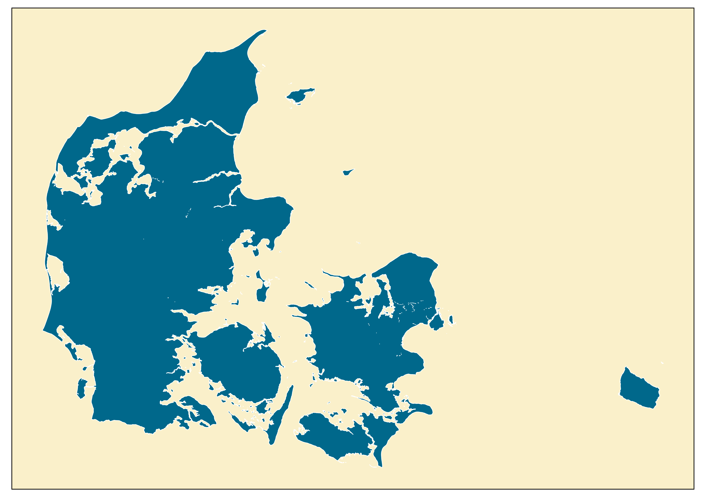
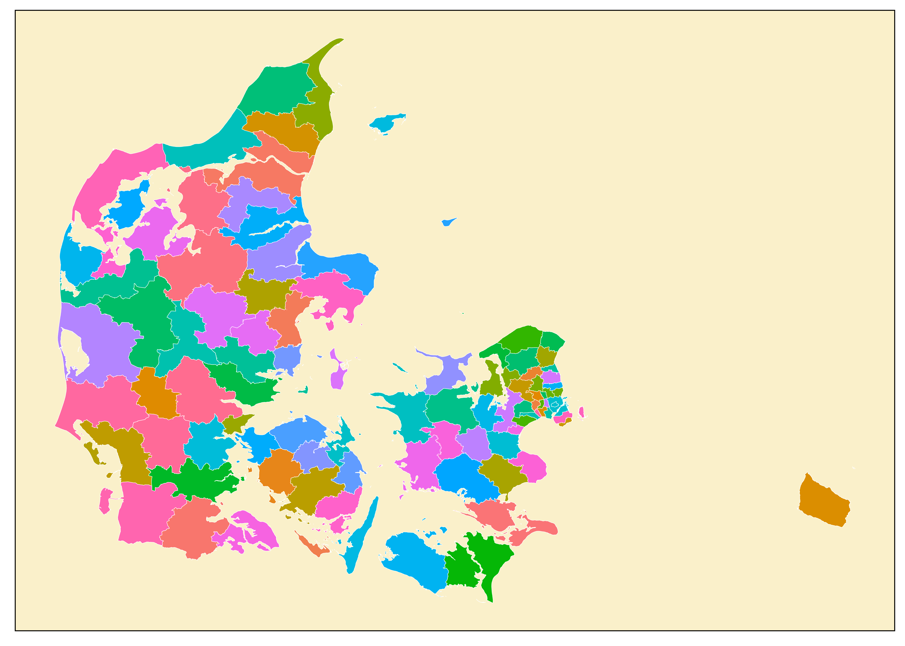
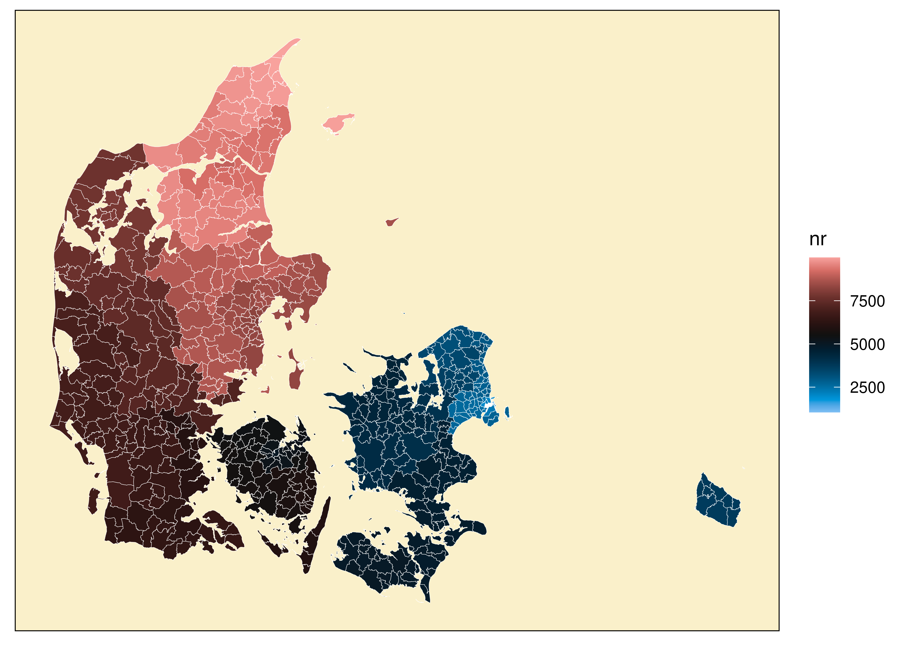
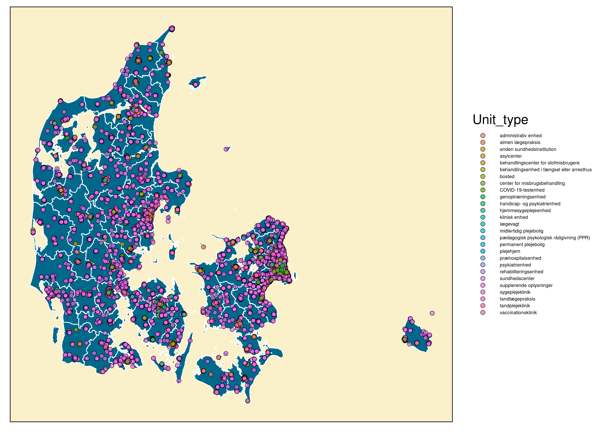

# Geographical code mapping

This folder contains the code I have used to generate maps that have the
different hospitals etc in it.

  

My own purpose is to visualize where the labtests are performed and
requisitioned. However, it might be of use to other people as well.

  

The readme was written in Quarto, but converted into md for the sake of
github. Pre-plotting steps are perfomed in python, plotting in R.

  

Important resources are:

1.  Medcom - Information on all medical providers
    1.  Henvisningstabel:
        https://medcom.dk/projekter/pakkehenvisninger/henvisningstabellen/
        1.  Information on the service provided (but has some ydernumre)
2.  SHAK-codes - Sygehus-afdelingsklassifikation
    1.  https://sor-filer.sundhedsdata.dk/sor_produktion/data/shak/
3.  SOR-codes - sundhedsvæsnets organisationsregister
    1.  https://sor-filer.sundhedsdata.dk/sor_produktion/data/sor/
4.  DAWA - geographical information based on addresses
    1.  Used via API to find coordinate / municipality of a given
        address

## Files:

All files are saved as geojson - very like json but with a geometry
column that contains coordinates that can be plotted. Geopandas also
have a lot of tools for working with the geometries.

## Scripts:

3 main scripts are there:

1.  data.py
    1.  Contains the data loading. Loads from the above mentioned
        webpages.
2.  coordinates.py
    1.  Adapts the loaded data and makes geojson files that contain
        stuff for plotting.
3.  plotting.r
    1.  Code for plotting the geojson in r. This includes code for
        loading the geojson and converting it to a tibble. This can also
        be done in python - although the geojsons can be directly loaded
        and plotted in geopandas / matplotlib.

## Plot examples:

Some examples of:

1.  Denmark and administrative divisions.
2.  Different Healthcare institutions.

### Plots of Denmark:

First of a simple plot of Denmark. The colors are just individual
“blobs”.

Then the regions:

The municipalities:

The Postal code:

That was it for administrative division, but more can be downloaded from
DAWA if you want to.

## Plotting healthcare institutions:

First the SHAK codes:

Then the Ydelses codes:

And the SOR-codes:

